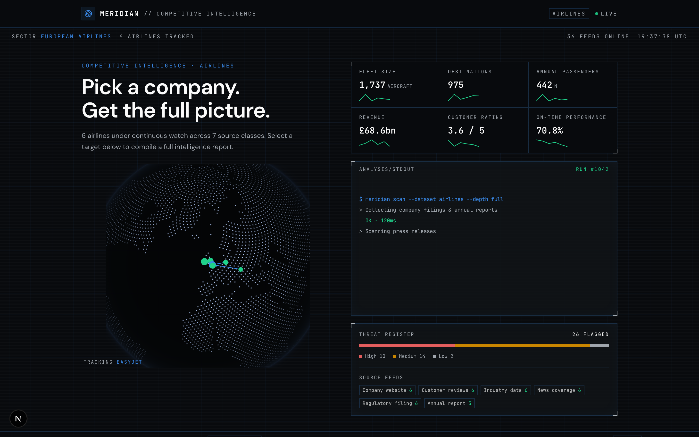
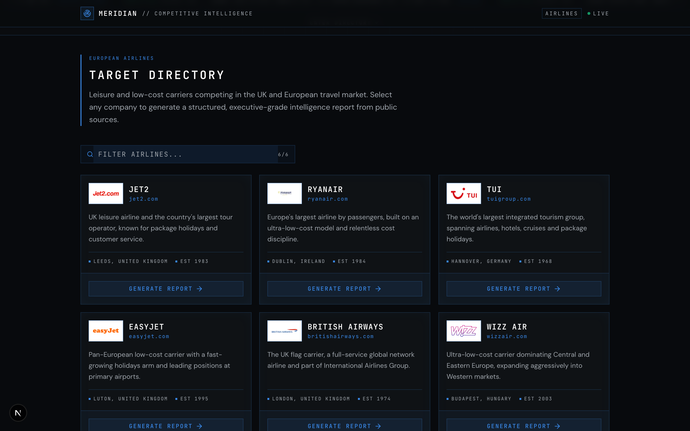
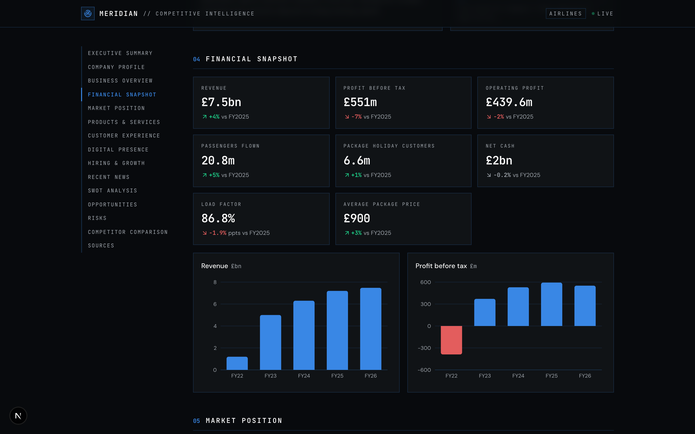
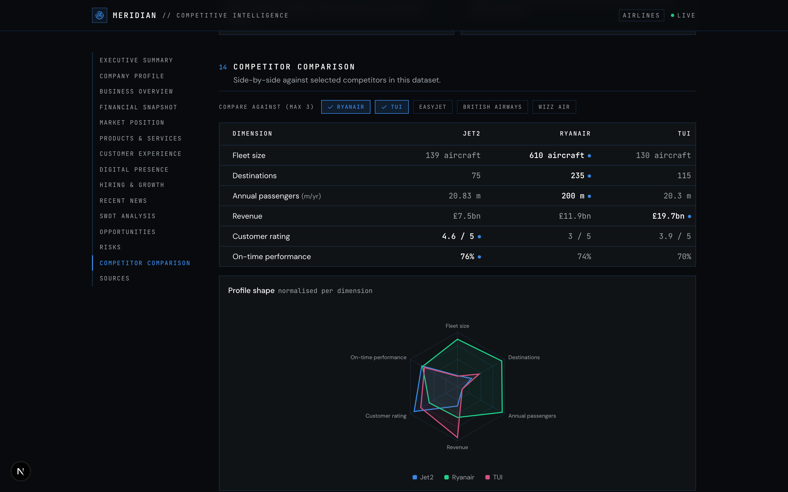

# Meridian — Competitive Intelligence Dashboard

**Status: ACTIVE** · **Live demo: [competitive-intel-dashboard-nu.vercel.app](https://competitive-intel-dashboard-nu.vercel.app)**

A proof-of-concept web application showing how an organisation (a Jet2, a bank, a retailer) could generate structured, executive-grade competitive intelligence reports about any company in a dataset. Pick a company, watch a simulated multi-source analysis run, and land on a full intelligence dashboard: executive summary, financials, market position, customer sentiment, SWOT, risks, competitor comparison and sources.

This is a demonstration of presentation and architecture, not of data collection. Every figure is realistic mock data assembled into the shapes a real pipeline would produce.









## What it does

- Searchable company directory with a card per company
- Simulated report generation with staged progress ("Collecting company filings", "Benchmarking against sector competitors", ...)
- A 15-section executive dashboard with scroll-spy navigation:
  Executive Summary, Company Profile, Business Overview, Financial Snapshot, Market Position, Products & Services, Customer Experience, Digital Presence, Hiring & Growth, Recent News, SWOT, Opportunities, Risks, Competitor Comparison, Sources
- Interactive competitor comparison: pick up to three competitors, get a best-value-highlighted table and a normalised radar profile
- Single dark console theme, responsive from 375px to desktop

## Architecture: datasets are plug-ins

The application renders generic types and nothing else. No component knows what an airline is.

```
src/
  lib/
    types.ts        # Dataset, Company, IntelligenceReport - the only vocabulary the UI speaks
    provider.ts     # IntelligenceProvider interface + MockProvider
    format.ts       # metric/number formatting
  data/
    registry.ts     # every dataset the app can serve
    datasets/
      airlines/     # first dataset: 6 European carriers
        index.ts    # companies, generation steps, comparison dimensions
        reports/    # one IntelligenceReport per company
  components/
    home/           # directory, search, company cards
    report/         # overlay, nav, 15 section components
    charts/         # thin theme-aware Recharts wrappers
```

Two seams make it reusable:

1. **Datasets.** "Fleet size" is not schema; it is a labelled profile field the airlines dataset chose to supply. Adding banks or AI companies means adding a folder under `src/data/datasets/` and one line in `registry.ts` - zero application-code changes. Comparison dimensions, generation stages and profile fields are all declared per dataset.
2. **The provider.** All data flows through the `IntelligenceProvider` interface (`src/lib/provider.ts`): `getDatasets`, `getCompanies`, `getReport`, `getComparison`. The mock implementation resolves from local files; a real implementation would call scrapers, APIs or a warehouse behind the same four methods. The generation overlay's fake stages map 1:1 to where real pipeline progress would surface.

## Stack

Next.js (App Router) · TypeScript · Tailwind CSS 4 · shadcn/ui · Recharts · cobe. One theme throughout: a dark operations-console palette defined as CSS variables, with a chart palette designed to stay distinguishable for colour-vision deficiency and checked for contrast against it.

## Run it

```bash
pnpm install
pnpm dev        # http://localhost:3000
pnpm build      # static export of all report pages
```

## Honest limitations

- All data is hand-written mock data, accurate in shape and only roughly in figures (mid-2026 public numbers).
- The generation stages are theatre; nothing is fetched.
- Company logos are locally stored images used for demonstration only; companies without one fall back to a monogram badge.
